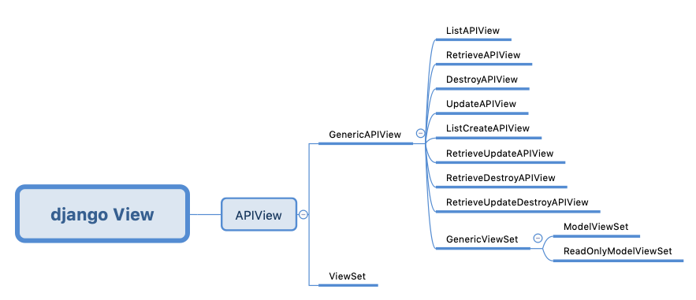

drf 中view的用法

DRF 中有多种view和viewsets， 如图




* ListAPIView 用法

```py
from rest_framework.generics import ListAPIView
from interface_app.models import Module
from common_app.utils import Pagination

class ModulesView(ListAPIView):
    authentication_classes = []

    queryset = Module.objects.all()[:10]
    serializer_class = ModuleSerializer
    pagination_class = Pagination
```

过渡的封装会带来一些问题：

1. 固定返回前10条数据，没有实现真正的分页。
2. 返回的数据格式是固定的。

如果要实现以上两点，需要修改代码如下。

```py

class ModulesView(ListAPIView):
    authentication_classes = []

    def list(self, request, *args, **kwargs):
        queryset = Module.objects.all()

        pg = Pagination()
        page_module = pg.paginate_queryset(queryset=queryset, request=request, view=self)
        ser = ModuleSerializer(instance=page_module, many=True)
        return response(data=ser.data)

```

如此以来，和 APIView 的实现方式基本一样了。

```python
class ModulesView(APIView):
    authentication_classes = []
    def get(self, request):
        """
        获得所有项目信息
        """
        modules = Module.objects.all()
        pg = Pagination()
        page_module = pg.paginate_queryset(queryset=modules, request=request, view=self)
        ser = ModuleSerializer(instance=page_module, many=True)
        return response(data=ser.data)

```
